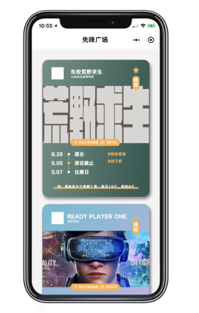
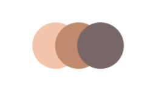

## 先蜂广场

展示校园活动

* 每场活动以’活动卡片‘形式展示，活动卡片包含信息有 活动名字、活动举办方（左边是举办方logo）、活动类型（是否关注）、活动海报（jpg图片）、活动范围和时间，往下是时间轴（一个活动可能有多个活动阶段，比如初赛复赛决赛）时间轴就是活动阶段展示形式、右边的 '# 体育章' 先不做

  卡片最下方下划线 上面的文字是一个问题，（就如同评论，有人向活动提出问题然后主办方回答，对应问与答）。这个数据库暂时没做，可以先做假数据

* 左上方正方形框框（改为圆形的框框，规格按照正方的长宽来就行）代表主办方logo

​	若一个活动有多个组织共同举办，采用如上形式显示logo，如果一个组织没有logo，显示默认logo

​	这里有一个动画效果，点击多社团logo，会先展开所有logo

​	单独点击单个logo，跳转至社团主页

* 活动范围是确定的，以中山大学为例，代表中山大学所有校区 或者 中山大学东校区 就是覆盖的范围
* 活动时间，用离当前日期最近的活动阶段日期代替，当前活动有N个活动阶段，哪个阶段的日期离当前日期最近就用这个日期展示，注意这个日期最好在当前日期以后
* 卡片的背景色是渐变颜色，暂时用UI图给的一个背景代替
* 点击星星，表示用户关注该活动
* 点击活动海报，会进入一个活动详情页（活动详情页设计图未出，先做一个跳转）
* 所有活动卡片的展示按照活动时间顺序，（从上到下 由晚到早）
* 上面的图片格式以iPhone 6 为基准

## 活动日历

校园活动的日历版本

// to do 画一个思维导图