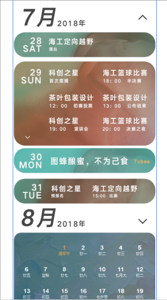

## 登陆

小程序采用自动登陆机制，用户只需要选择学校 + 校区，做自动登陆（并且有登陆态维持）

小程序的登陆确定两个比较重要的信息，一是学校，二是个人信息，小程序的活动资讯都是根据学校为基础来展示的，在‘我的’页面，显示的信息基本是存储在数据库的用户信息，请求后端API可能需要带到个人的用户名等。

## 先蜂广场

展示校园活动

* 最顶上标识校园的图标，是根据用户选用的校区来决定的，校徽、背景图请求后端得到，这个暂时做假数据。右边是当前的日期 7/31 底下标识星期

* 每场活动以’活动卡片‘形式展示，活动卡片包含信息有 活动名字、活动举办方（左边是举办方logo）、活动类型（是否关注）、活动海报（jpg图片）、活动范围和时间，往下是时间轴（一个活动可能有多个活动阶段，比如初赛复赛决赛）时间轴就是活动阶段展示形式、右边的 '# 体育章' 先不做

  卡片最下方下划线 上面的文字是一个问题，（就如同评论，有人向活动提出问题然后主办方回答，对应问与答）。这个数据库暂时没做，可以先做假数据

* 左上方正方形框框（改为圆形的框框，规格按照正方的长宽来就行）代表主办方logo

​	若一个活动有多个组织共同举办，采用如上形式显示logo，如果一个组织没有logo，显示默认logo

​	这里有一个动画效果，点击多社团logo，会先展开所有logo

​	单独点击单个logo，跳转至社团主页

* 活动范围是确定的，以中山大学为例，代表中山大学所有校区 或者 中山大学东校区 就是覆盖的范围
* 活动时间，用离当前日期最近的活动阶段日期代替，当前活动有N个活动阶段，哪个阶段的日期离当前日期最近就用这个日期展示，注意这个日期最好在当前日期以后
* 卡片的背景色是渐变颜色，暂时用UI图给的一个背景代替
* 点击星星，表示用户关注该活动
* 点击活动海报，会进入一个活动详情页（活动详情页设计图未出，先做一个跳转）
* 所有活动卡片的展示按照活动时间顺序，（从上到下 由晚到早）
* 上面的图片格式以iPhone 6 为基准

## 活动日历

校园活动的日历版本

* 活动日历展示**活动阶段**，而不是活动，活动和活动阶段是包含的关系，一个活动有多个活动阶段，N个活动阶段可从属于某个活动
* **活动日历可上下滑动，而且当前月份和其他月份的显示有区别**
* 活动日历展示从当前月份起到当年内结束的所有月份 （按照上面UI，就是7月份 - 12月份）
* 每个月份可以展开或折叠
* 当前月份按照上面7月份的视图展示，其他月份按照一般的日历视图（并且标有节日）
  * 按照上面7月份的视图，每一天都是一个圆角矩形，并且可以展开，如果当天的阶段多余两个，可以设置展开，如果少于两个，无需展开，如果无任何活动阶段，设置为 **图蜂酿蜜，不为己食** 字样且旁边有橙色的Tobee字样
  * 每个活动阶段显示 **简称、开始时间（数据库有开始时间也有结束时间）、地点**
  * 每个日期下面显示星期的英文形式 如 Monday、Tuesday等
* 除了当前月份，其他月份每个日期下面是中国农历的日期形式，可见上图8月份的UI
* UI图内有多个渐变色块，暂时以一个色块代替（文件夹内有一个）
* 点击某个活动名，进入该活动的活动详情页面